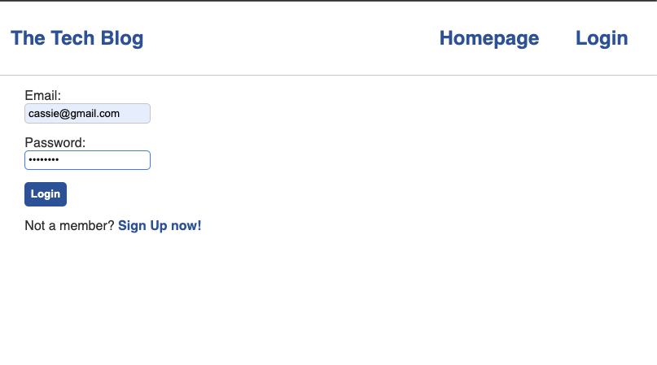

# Note Taker
  
  ## Description
  This application is a simple CMS blog. Authorized users can create posts, edit posts, delete posts, and comment on posts.

  
  ## Table of Contents
  * [Installation](#installation)
  * [Usage](#usage)
  * [License](#license)
  * [Contributing](#contributing)
  * [Tests](#tests)
  * [GitHub](#github)

  ## Installation
  Use the deployed version at: https://secret-mesa-68493.herokuapp.com/ or clone via Heroku.

  ## Usage
  Log in or sign up to create posts and comment on them.  
  

  ## License
    
  This project uses  the [MIT](https://opensource.org/licenses/MIT) license.

  ## Contributing
  This project follows the Contributor Covenant.  
  

  ## Questions
  Reach out via email or GitHub.  
  cassie.s.simpson@gmail.com  
  [https://github.com/cassie-s](https://github.com/https://github.com/cassie-s/)
